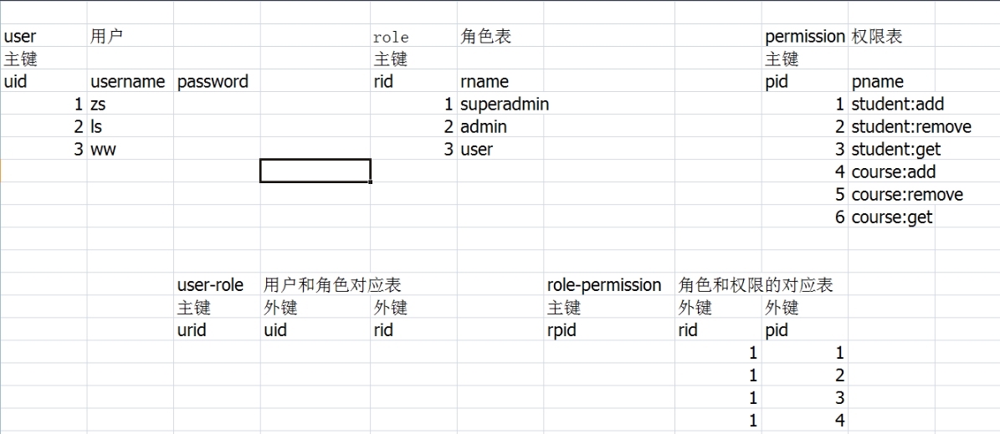

springsecurity 2022/7/1

* springsecurity 的使用
  * public class LoginUserDetail implements UserDetails
    * 根据前端的用户名预存储该用户正确的账号和密码的信息(信息来自数据库，用于验证)
  * public class UserDetailServiceImpl implements UserDetailsService
    * 根据接收的用户名，在数据库中查询对应的账号信息，并封装为 LoginUserDetail 返回
  * public class UserController
    * 根据前端传递的 user 调用 LoginService 
    * UserController 的使用必须重写框架底层原有的默认 Controller，配置配置类
      * protected void configure(HttpSecurity http)
  * public class LoginServiceImpl implements LoginService
    * 根据框架的 AuthenticationManager 验证前端的 user 数据是否和数据库中的一致(前端的 user 数据是否和 LoginUserDetail 一致)
  * public class SpringSecurityConfig extends WebSecurityConfigurerAdapter
    * springsecurity 的配置类
      * 启用密码加密
      * 配置认证管理器，供 LoginServiceImpl 账户认证使用
      * 配置过滤拦截，配置后，自己的 login 将代替框架的 login
  * 启用授权
    * 配置类注解 @EnableGlobalMethodSecurity(prePostEnabled = true)
    * 方法权限方法注解 @PreAuthorize("hasAnyAuthority('t')")
    * 权限表的设计
      * 

* unauthorized 登录失败 401
* forbidden 没有权限 403
