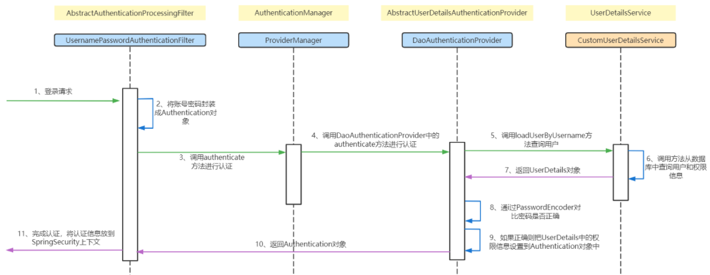

springsecurity 2022/7/1

* springsecurity 的使用
  * 认证
    * UserDetailService接口：需在配置类配置密码转换
      * loadUserByUsername()方法，可根据用户名在数据库获取用户完整信息，并封装为UserDetails接口的实现类对象UserDetail
    * AuthenticationManager对象：需在配置类注入该对象
      * authenticate()方法，该方法中传入controller中传入的username和password封装的Authentication和UserDetail对象对比，即可认证controller中的用户名和密码和数据库中的用户名和密码是否一致
        * 若认证失败框架抛出异常
        * 若认证成功根据用户名生成token，并将token响应给前端，将Authentication封装到springsecurity上下文对象中
    * OncePerRequestFilter接口：需在配置类配置在最前面执行该过滤器
      * doFilterInternal()方法，认证后用户用户携带token访问其他controller前会进入该filer，该filter中根据缓存中是否存在该token对应的用户正确信息而在springSecurity上下文中存放用户信息封装的Authenticaiton，该对象的存在可以使得该请求是否具有访问其他controller的权限
    * LoginController：/login 访问路径默认为框架的默认controller，需在配置类配置指定自己的controller

