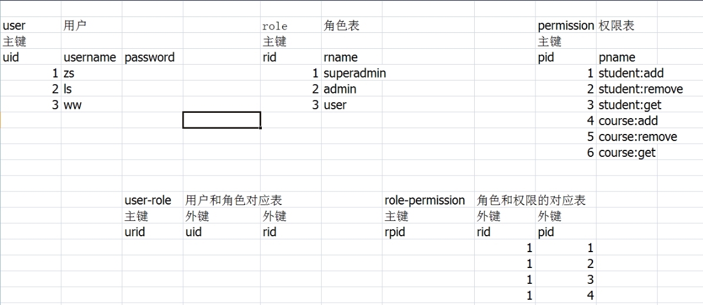

springsecurity 2022/7/1

* springsecurity 的使用
  * 授权
    * UserDetails接口
      * getAuthorities()可获得该user的所有权限
  * 启用授权
    * 配置类注解 @EnableGlobalMethodSecurity(prePostEnabled = true)
    * 方法权限方法注解 @PreAuthorize("hasAnyAuthority('t')")
    * 权限表的设计
      * 

